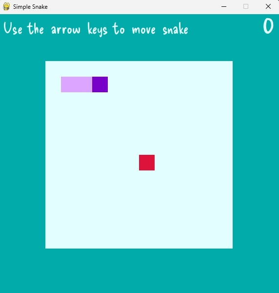

# Simple Snake

## A super simple Snake game made in PyGame

This is a really simple Snake-style game created using PyGame to demonstrate some core PyGame functionality.

You can customise the grid size, speed, colours and fonts in the settings.py file.

 
